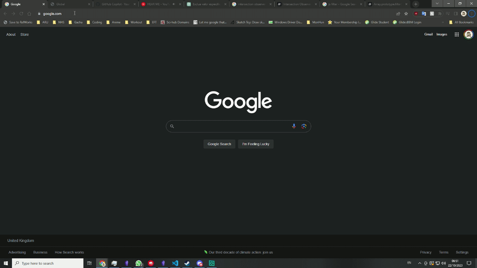

# Welcome to my portfolio website

put a cute icon / picture here!

short description here?

- [Components](#website-components)
- [Responsiveness](#responsiveness-considerations)
- [Bugs](#bugs)
- [Development Log](#development-log)

## Website components
### UI Elements
- Navigation bar/pane (scrollspy?? check your bookmarks!)
- Landing page banner
	- Portrait
	- List of languages I can use and currently learning
- Main content sections
	- About me:
		A relatively brief biography of myself
	- Projects:
		Consist of card elements linking to the github repo for the website, all of my personal projects and the corresponding github repos and links to group projects I've worked on.
	- Blog:
		A log to make public notes of learning, but this isn't optimal in the current format?
		Would need a DB to be fully functional? consider embedding something external?
	- Contact:
		consider a forms element for an email? or maybe just a stylistic card layout of my lanes of contact?

### JS Elements
- toggling for navigation bar/panel and animation
- toggle for theme toggling
- tracking for animation on scroll - partial
- tracking for mouse hover for card animation in the project and contact sections
- A vanilla JS scrollspy function for webpage navigation
## Responsiveness considerations
- The overflow of the sections on smaller than 1080p screen sizes results in bleeding of the content on to the adjacent ones. need to consider using at @media rules or maybe even JS to determine the screen size then adjust content size accordingly
- nav bar needs a reposition to be able to be used on phones?
- Contact grid is probably a mess right now with phone screens

## Bugs
- ~~magical anchor elements appearing in chrome for the project cards~~
	- currently by passed but only having anchors on buttons
- the text in the about me overflow the section on some phones, and for others trying to scroll to read the text triggers the scroll snap.
- ~~nav bar links will not won't scroll on click~~
	- needed to change the `z-index` to have the nav bar at the front, 

## Development Log
- [Nesting nightmare 😨](#css-nesting-nightmare)
- [Contact grid](#contact-grid)
- [Responsiveness](#responsiveness-adjustments)
- [Landing Page](#landing-page)
- [Navigation bar](#navigation-bar)
- [Animate on scroll](#animate-on-scroll)
- [Project cards](#project-cards)
- [Scroll snapping](#scroll-snapping)

### CSS nesting nightmare 😅
After reading up about the new CSS nesting features that were rolled out recently, I was eager to try them. At this point I had started to use Firefox alot more to inspect my web development. One thing I forgot to check for with new features like this is how widely supported it is, and much to my horror, Chrome hadn't put in it's support yet. Meaning that none of the CSS for the contact grid and new adjustments for the buttons and project tiles were working on chromium based browsers. A slow and pain staking process of scrolling through the stylesheet to move all the nested child selectors and correctly path them was due.

### Contact grid
#### 0.3
- Added `minmax()` to the end grid columns to ensure the image boxes don't squish too narrow when the window is collapsed widthways
- added more content to the grid
	- icons with anchors
	- freeCodeCamp certifications
- An adjustment for mobiles is still very much needed

#### 0.2
After researching, trying some solutions offered by chatgpt to no avail. The only solution i could find was to target each grid item using the `:nth-of-type` selector, and then individually adjusting the `grid-column` property to for each of those items.
The problem is that this is essentially hard coded which means it is clunky and results in alot of repeat code. but it works so it will just have be be deployed as is until I can find a better solution in future as i learn CSS grid better.
One concern I have with it right now is the responsiveness of the physical elements in the grid at the moment, since the grid tracks do adjust with the window size, but it means with very small screens like on phones the tiles become tiny width ways and the content within the tiles deform or don't properly fill the tiles. I believe I need to consider using the `minmax()` property within the grid template to control the tracks. 

#### 0.1
I knew nothing about CSS grid as I mostly rely on flex box to do similar layout designs. But felt it was a perfect moment to learn grid for this specific component.
The `grid-template` properties made sense on how to create tracks for physical elements to fall into upon which using fr units would mean that the track area would adjust very easily with different screen sizes and changing of the window size.
As for the physical elements I was able to adjust them to the sizes I want them to be; 2 tiles per row, one tile is 1fr wide and the other being 3 but they are the in the same order each row which is not what I wanted but rather to alternate the order of the pairs with every row.

### Responsiveness adjustments
#### 0.1
using @media rules adjusted the sizing of elements. I initially did this by manually changing the px numbers of certain elements, which was very inefficient and  required alot of repeat code, but since I used `rem` for a majority of the webpage, instead I was able to change `font-size` in the `:root` selector to change the size across the page.

I consolidated some of the separated stylesheets of specific sections into the main stylesheet

The format/positioning of elements of the landing page was completely changed and for phones and the projects section too.

### Landing Page
#### 0.4
added a portrait with linear gradient to banner and basic elements for the language icon tiles and added a credits section at the bottom for the icons and added JS code to apply `target=_blank` attribute to all anchor links but exclude the ones in the nav bar array with the `filter` and `setAttribute` methods

### Navigation bar
#### 0.4
added a filter for scrollspy to exclude the "credits" section to prevent the scrollspy function from throwing an error.
#### 0.3

- added `intersectionObserver` tracking to the navbar for scrollspy 
- JS addition and removal of "active" class on navbar anchors to allow for the css animation of scrollspy functionality
- added some animation to the navbar light up
A note to be made here that the `filter` method can't utilise the `nodelist`  iterable created by `quesrySelector`. Considering this it is necessary to use `Array.from` to convert it to an array.
#### 0.2

- the `::marker` elements we not easy to manipulate to fit the aesthetic I want for the nav bar so they were removed and replaced with a `::before` element.
- with the new `::before` element `vertical-align` can be uses to make it central
- changed up how the colour of text was assigned allowing better selection with the nav items
- added linear gradient to the navbar line
#### 0.1

- used `::before` on nav to create a line element for the list items to sit on
- `list-style-position` to move marker on to `::before` line
- adjusted padding of main sections to make space for side navigation bar
- used flexbox to position main content in center to align with the nav bar
- added fade in animation to the navbar too
- added "active" css in place for the JS to be implemented now

### Animate on scroll
#### 0.3
Added intersect observer `threshold: 1` option allowing better control of when the element appears (when it is fully visible rather than immediately from 1px)
#### 0.2
Had problems where using the `@keyframes` method of animation would have the animation play out and then the elements would go back to `opacity: 0;` and therefore disappearing. 
This was because the animation would play out then reset to it's start state, where I on the other hand want it to finish at it's end state. I have to use `animation-fill-mode: forwards;` to ensure the animation holds in it's end state.
#### 0.1
The previous iteration of the website used `intersectObserver` to track whether elements were visible. A problem this posed was elements would start loading in immediately when a single pixel was visible on the browser. This result in either the animation not being seen, or it'd be part way during the scroll. The immediate solution at the time was to put a delay on the transitions, but that would result in the webpage feeling a little slow and clunky.

I have applied the same format to the current iteration for now, but currently looking into whether the use of `getBoundingClientRect` or looking into some of the sub properties of `intersectObserver` can be used to rectify this.

### Project cards
#### 0.3
Redid the project cards, removed the blanket flexbox on the card, centralised the images and bound the link buttons to the bottom of the card
something to note is that, for an element with to sit at the bottom of a wrapper, the parent element should be given `position:relative` then the child can be given `postion:absolute` and `bottom:0` so that the child is bound to the bottom of the parent wrapper element.

#### 0.2
Did a touch up on how the project card would look like in terms of colouring and, added:
- box shadow
- hover glow affect
- border radius
At present there is a bug that seems to render only in chrome where it'll create separate `a` elements on the top and bottom half of the card

whereas the source html is structured as such

which causes problems when attempting to use flexbox to position the elements.

#### 0.1
In my previous iteration of my portfolio page, I used a tile that would expand, which would show the title and description of the project. The problem I had with this was the animations and transform transitions would conflict with the initial fade in animation I had in place blanketed on the website.
For now I have pieced together a very simple card element as a place holder until I have a better idea of what I want it to be structure and look like.

### Scroll snapping
I had previously attempted to implement scroll snapping in a HTML document and I would run into the problem of it breaking the navigation bar scroll animation to the specific section when in use. After looking into it more, it seems that scroll snapping functions a lot better when the child content overflows the parent box and then you ensure each child element height correspond to the parent box height.
A note should also be made that that `scroll-snap-stop: always;` allows sections to not be skipped when scrolling fast, but this only works for touch screens.

### Initial commits
Laid out the general files for the website and plans on the structure and components of the website