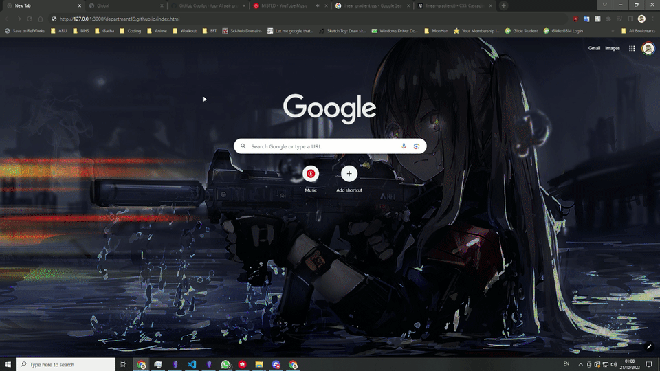
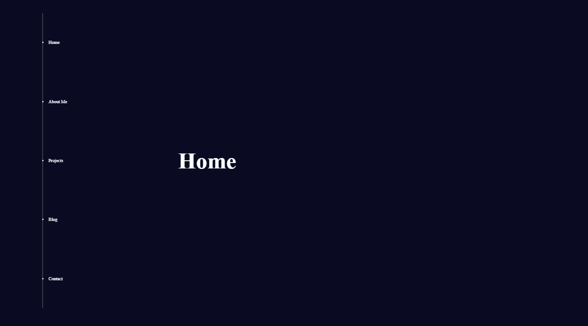
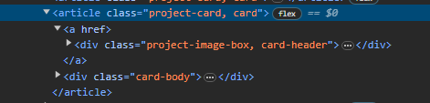
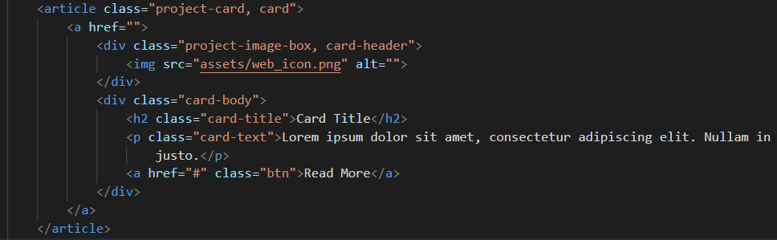

# Welcome to my portfolio website

put a cute icon / picture here!

https://department19.github.io/

short description here?

- [Components](#website-components)
- [Responsiveness](#responsiveness-considerations)
- [Bugs](#bugs)
- [Development Log](#development-log)

## Website components
### UI Elements
- Navigation bar/pane (scrollspy?? check your bookmarks!)
- Landing page banner
	- Portrait
	- List of languages I can use and currently learning
- Main content sections
	- About me:
		A relatively brief biography of myself
	- Projects:
		Consist of card elements linking to the github repo for the website, all of my personal projects and the corresponding github repos and links to group projects I've worked on.
	- Blog:
		A log to make public notes of learning, but this isn't optimal in the current format?
		Would need a DB to be fully functional? consider embedding something external?
	- Contact:
		consider a forms element for an email? or maybe just a stylistic card layout of my lanes of contact?

### JS Elements
- toggling for navigation bar/panel and animation
- toggle for theme toggling
- tracking for animation on scroll - partial
- tracking for mouse hover for card animation in the project and contact sections
- A vanilla JS scrollspy function for webpage navigation
## Responsiveness considerations
- The overflow of the sections on smaller than 1080p screen sizes results in bleeding of the content on to the adjacent ones. need to consider using at @media rules or maybe even JS to determine the screen size then adjust content size accordingly

## Bugs
- magical anchor elements appearing in chrome for the project cards

## Development Log
- [Navigation bar](#navigation-bar)
- [Animate on scroll](#animate-on-scroll)
- [Project cards](#project-cards)
- [Scroll snapping](#scroll-snapping)

### Navigation bar
#### 0.3
- added `intersectionObserver` tracking to the navbar for scrollspy 
- JS addition and removal of "active" class on navbar anchors to allow for the css animation of scrollspy functionality
- added some animation to the navbar light up
#### 0.2

- the `::marker` elements we not easy to manipulate to fit the aesthetic I want for the nav bar so they were removed and replaced with a `::before` element.
- with the new `::before` element `vertical-align` can be uses to make it central
- changed up how the colour of text was assigned allowing better selection with the nav items
#### 0.1

- used `::before` on nav to create a line element for the list items to sit on
- `list-style-position` to move marker on to `::before` line
- adjusted padding of main sections to make space for side navigation bar
- used flexbox to position main content in center to align with the nav bar
- added fade in animation to the navbar too
- added "active" css in place for the JS to be implemented now

### Animate on scroll
#### 0.3
Added intersect observer `threshold: 1` option allowing better control of when the element appears (when it is fully visible rather than immediately from 1px)
#### 0.2
Had problems where using the `@keyframes` method of animation would have the animation play out and then the elements would go back to `opacity: 0;` and therefore disappearing. 
This was because the animation would play out then reset to it's start state, where I on the other hand want it to finish at it's end state. I have to use `animation-fill-mode: forwards;` to ensure the animation holds in it's end state.
#### 0.1
The previous iteration of the website used `intersectObserver` to track whether elements were visible. A problem this posed was elements would start loading in immediately when a single pixel was visible on the browser. This result in either the animation not being seen, or it'd be part way during the scroll. The immediate solution at the time was to put a delay on the transitions, but that would result in the webpage feeling a little slow and clunky.

I have applied the same format to the current iteration for now, but currently looking into whether the use of `getBoundingClientRect` or looking into some of the sub properties of `intersectObserver` can be used to rectify this.

### Project cards
#### 0.2
Did a touch up on how the project card would look like in terms of colouring and, added:
- box shadow
- hover glow affect
- border radius
At present there is a bug that seems to render only in chrome where it'll create separate `a` elements on the top and bottom half of the card

whereas the source html is structured as such

which causes problems when attempting to use flexbox to position the elements.

#### 0.1
In my previous iteration of my portfolio page, I used a tile that would expand, which would show the title and description of the project. The problem I had with this was the animations and transform transitions would conflict with the initial fade in animation I had in place blanketed on the website.
For now I have pieced together a very simple card element as a place holder until I have a better idea of what I want it to be structure and look like.

### Scroll snapping
I had previously attempted to implement scroll snapping in a HTML document and I would run into the problem of it breaking the navigation bar scroll animation to the specific section when in use. After looking into it more, it seems that scroll snapping functions a lot better when the child content overflows the parent box and then you ensure each child element height correspond to the parent box height.
A note should also be made that that `scroll-snap-stop: always;` allows sections to not be skipped when scrolling fast, but this only works for touch screens.

### Initial commits
Laid out the general files for the website and plans on the structure and components of the website